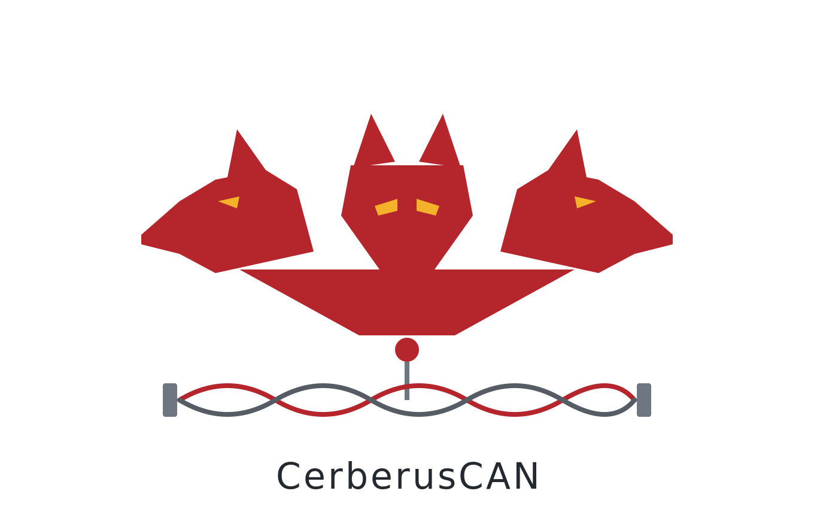

<p align="center">
  <picture>
    <source media="(prefers-color-scheme: dark)" srcset="docs/brand/cerberus-can-logo-dark.png">
    
  </picture>
</p>

<p align="center">
  <strong>Teensy 4.0/4.1 tri-CAN OBD VCI for VAG — drive an active diagnostic session and
  losslessly log the wire at the same time, from one plug.</strong>
</p>

> **Status — v0.9.6, pre-1.0.** **Dual-head hardware-validated on a 2013 Audi A6 C7:** both heads
> read VIN / part numbers / the gateway part over multi-frame ISO-TP, and Head 2 (listen-only)
> losslessly logged a **live ODIS Component-Protection session** while the dealer tool drove it.
> Builds for **Teensy 4.0 *and* 4.1**, and ships with a desktop app — **CerberusConsole**
> (sniff · diagnostics · one-click firmware update). The **write / CP** paths are implemented but
> bench/experimental — not validated end-to-end on a car. The **OLED** output is built-to-API but
> not yet panel-verified. Don't point write features at a car you can't recover.

Cerberus turns a Teensy 4.0/4.1 (NXP i.MX RT1062, 600 MHz Cortex-M7) into a **request-level** VAG
VCI: you hand it a UDS request and the *firmware* runs the whole ISO-TP transaction on-device.
Three independent FlexCAN controllers let it do what a normal single-channel adapter can't —
**run an active UDS/CP exchange on one head while losslessly logging the unmasked wire on a
second**, so you can capture a Component-Protection handshake *as you drive it*.

> **Three heads guarding the gate** — the gate being VAG's gateway (J533) and everything it
> hides behind Component Protection. Cerberus is the three-headed guardian of the gate; its
> two-headed brother **Orthrus** (Teensy 4.0) is the compact watch-dog. See **[the lore](docs/LORE.md)**.

## The three heads

| Head | FlexCAN | Teensy pins | Role |
|------|---------|-------------|------|
| **1** | CAN1 | 22 / 23 | **Active VCI** — Diagnostic CAN (OBD **6/14**), 500 k. UDS read/write/CP, SCAN, RAW, CANX. |
| **2** | CAN2 | 0 / 1 | **Always-on logger** — a *2nd* `SN65HVD230` paralleled on the **same OBD 6/14**, held LISTEN-ONLY. Captures the bus while Head 1 drives (`MON`). |
| **3** | Serial2 (UART) | 7 / 8 | **K-line / KWP2000** — single-wire 12 V bus (OBD **7**) via a K-line transceiver (`TJA1021`), for **pre-CAN VAG**. ISO 14230 fast + 5-baud slow init, framed `KWP` requests. *(K-line is a UART, not CAN — repurposed from the CAN3 spare. Firmware built, **bench-untested** pending the transceiver.)* |

> **Both heads tap the 500 k diag bus.** On gateway cars (incl. the C7) the OBD port is
> firewalled to the diagnostic CAN, and the gateway routes the comfort/CP traffic (seat, HVAC)
> onto that bus over VW TP 2.0 — so Head 2 logs it right there. A *direct* comfort-bus tap is a
> future Head-3 plug-in (`TJA1055T/3`). See [docs/HARDWARE.md](docs/HARDWARE.md).

## Features

- **Request-level UDS/ISO-TP on-device** — single + multi-frame, flow control, block-size/STmin,
  `0x78` response-pending, all handled on the Teensy. Writes need no special command (a payload
  >7 bytes is auto First-Frame/CF framed).
- **Dual-head capture** — active Head 1 + always-on listen-only Head 2 logger (`MON`), backed by
  a **256 KB OCRAM ring buffer** so a USB stall or a long blocking transaction never drops frames
  (`MON:stat` reports peak/dropped).
- **Modes** — `MODE:vci|sniff|dual`: one command sets both heads. **`sniff` = BOTH heads
  listen-only = zero bus footprint**, safe to log a live ODIS/dealer session without touching it.
- **`SELFTEST`** — factory/bring-up QC: loopback both controller cores + a Head-1→Head-2 wire check,
  PASS/FAIL, no extra gear. **`REBOOT`** drops to the bootloader so the host can flash.
- **SLCAN (Lawicel) mode** — drops into the wider ecosystem: SavvyCAN, python-can, `slcand`→SocketCAN.
- **`EMU` responder mode** — emulate a module (UDS server with rule-matched responses) to probe how
  J533 / a tester reacts. Bench play; needs a 2nd node to drive it.
- **Optional SSD1306 OLED HUD** (auto-detected) — live **mode** title + per-head **VU bars**.
- **Builds for Teensy 4.0 *and* 4.1** — same features; `INFO` reports the board so the app flashes
  the right hex. (4.0 = compact 2-head unit; 4.1 = solder-friendly Head 3 + SD/ethernet headroom.)

## Desktop app — CerberusConsole

A plug-and-go GUI (`host/cerberus_console.py`, pyserial + tkinter — **no Simos-Suite needed**),
organised by Cerberus's heads:

- **CANBUS** (Heads 1–2) — **Sniff** (passive Head-2 trace + chronological *Record session* CSV) and
  **Diagnostics** (Head-1 UDS: VIN/Part, **Read + Clear DTCs** with **SAE J2012** English text).
- **K-Line** (Head 3) — KWP2000 **and KW1281**: init (fast / 5-baud / KW1281), session, ECU-ID,
  **Read + Clear faults** (VAG DIDB text) + **live measuring blocks** (scaled via `formula.py`), per
  module address. *(Needs the K-line transceiver — bench-untested.)*
- **Firmware** — running version + board vs bundled, **one-click flash/update** (via `REBOOT` +
  `teensy_loader_cli`, matching hex/`--mcu` per detected board).

DTC text comes from two vetted tables, branched by transport: **SAE J2012** (`saedb/`, ~1,680 generic
P/U codes) for CAN/UDS, and the **VAG DIDB** (`didb/`, 4,817 fault-locations) for K-line. Switching
views sets the right `MODE` automatically; version + board show in the title bar; it auto-reconnects
if a USB link drops. **Single-file build:** `cd host && build_exe.bat` → `dist/CerberusConsole.exe`
(bundles both hexes + the flasher — see [host/BUILD-EXE.md](host/BUILD-EXE.md)).

## Flash

```bash
# A) one-click: CerberusConsole -> Firmware tab -> Flash (auto-picks the hex for your board)
# B) no toolchain: open firmware/cerberus-can-teensy4{0,1}.hex in Teensy Loader (INFO shows version + board)
# C) from source (PlatformIO):
pip install platformio
python -m platformio run -e teensy41 -t upload     # or:  -e teensy40
```

## Wiring

**Head 1 (active)** through a 3.3 V `SN65HVD230`: OBD 6→CANH, 14→CANL, 4→GND; board CTX→Teensy 22,
CRX→Teensy 23, VCC→3V3, GND→GND.

**Head 2 (logger)** — a *second* `SN65HVD230`: CANH→OBD 6, CANL→OBD 14 (paralleled on Head 1),
CTX→Teensy 1, CRX→Teensy 0, VCC→3V3, GND→GND.

- **Remove the 120 Ω terminator from *both* breakouts** — the car already has ~60 Ω; the taps must
  add none.
- **Tie Teensy GND to OBD/chassis GND.**
- *(Clone boards mislabel CTX/CRX — if no comms, swap the pair.)*

**OLED (optional):** SDA→18, SCL→19, VCC→3V3, GND→GND. Auto-detected at 0x3C/0x3D; 128×64 default
(`#define OLED_128x64`; comment for a 0.91" 128×32).

Full BOM + bring-up: **[docs/BUILD.md](docs/BUILD.md)**.

## Host protocol (USB serial, 115200)

ASCII, one command per line:

```
<TX>:<RX>:<HEX>               UDS on Head 1 (shorthand)            710:77A:2200BE
UDS:<bus>:<TX>:<RX>:<HEX>     full ISO-TP UDS on bus 1|2           UDS:1:710:77A:2E00BE…
RAW:<bus>:<ID>:<HEX>          send ONE classic frame (no ISO-TP)
CANX:<bus>:<ID>:<HEX>[:ms]    send one frame then listen ms        (low-level send-then-listen)
SCAN:<bus>[:lo:hi[:win]]      active responder sweep (TesterPresent)
SNIFF:<bus>:<ms>[:lo:hi]      passive LISTEN-ONLY dump
MON:on[:lo:hi] | off | stat   always-on Head-2 ring-buffered logger  -> M2:<ms>:<id>:<hex>[:OVR]
MODE:vci|sniff|dual           set both heads (sniff = BOTH listen-only, zero footprint); MODE reports
HEAD2:active|lom              flip Head 2 between a 2nd active VCI and the listen-only logger
H2TEST                        Head-1-listens-while-Head-2-transmits TX-path self-test
SELFTEST                      QC: CAN1/CAN2 loopback + H1->H2 wire check -> PASS/FAIL
EMU:on:<bus>:<REQ>:<RESP>     emulate a module (UDS responder)     EMU:add:<prefix>:<resp> rules
TP:<bus>:<TX>:<ms> | TP:STOP  background TesterPresent keep-alive
STATS:<bus>                   CAN error counters / bus health
SLCAN                         enter Lawicel mode on Head 1 (reset to exit)
KWP:fast[:tgt] | slow:<addr>  Head 3 K-line / KWP2000 init (ISO 14230 fast / 5-baud slow)
KWP:<hex> | raw:<hex> | off   framed KWP request / raw bytes / close  (pre-CAN VAG)
KWP:passthrough[:baud]        transparent "dumb KKL cable" — raw K-line<->USB (reset to exit); for NefMoto et al.
REBOOT                        jump to the bootloader (host firmware flash)
INFO  /  PING                 INFO -> CERBERUS:<ver> board=T4.0|T4.1 …

-> OK:<resphex> | ERR:<reason> | RX:<ms>:<id>:<data> … DONE:<n>
```

## Host scripts (`host/`)

- **`cerberus_console.py`** — the **CerberusConsole** desktop app (above). Start here. `build_exe.bat`
  freezes it to a single `.exe`. (`cerberus_sniff_gui.py` is the older minimal sniffer, now superseded.)
- **`cerberus_sniff.py`** — live `SNIFF`/`MON` capture, per-ID summary, CSV out.
- **`cerberus_decode.py`** — turn a capture into labeled UDS/KWP exchanges (ISO-TP **+ VW TP 2.0**),
  flagging the CP-relevant services (TrainICA, `0x00BE` IKA write, SecurityAccess).
- **`cerberus_probe.py`** — Experiment 1: reads `0x00BE` across J533/J255/J136/J285 (VIN-bound vs
  module-bound verdict).
- **`cerberus_write.py`** — careful generic UDS write: read-before → confirm → `2E` → read-back, `--dry-run`.
- **`sample_capture.csv`** — a VIN-free real-C7 slice to try the decoder with **no hardware**.

**Seen in the wild:** a real [`SCAN` of a 2013 Audi A6 C7](docs/example-scan-c7-a6.md) — one head
mapped and named the whole car off the gateway.

## Roadmap

- [x] Head 1 @ 500 k — request-level ISO-TP/UDS read + write
- [x] Hardware listen-only sniff (LOM)
- [x] Dual-head: active VCI + always-on ring-buffered logger (`MON`) — **validated on a live car**
- [x] `MODE` vci/sniff/dual — zero-footprint sniff alongside a dealer/ODIS tool
- [x] Captured a **live ODIS Component-Protection session** via the dual tap
- [x] `SELFTEST` QC + `REBOOT` host-flash; **Teensy 4.0 + 4.1** dual-target builds
- [x] **CerberusConsole** desktop app (sniff · diagnostics · one-click firmware) + single-`.exe` build
- [x] SLCAN ecosystem interop (SavvyCAN / python-can / SocketCAN)
- [x] OLED status HUD (mode + VU bars)
- [x] Simos-Suite drives Cerberus (dual-head driver + CP Capture live view + `set_mode`)
- [x] `EMU` responder mode — fake a module to probe the gateway / CP from the other side
- [ ] Head 3 configurable tap channel (CAN-FD / `TJA1055T/3` comfort bus)
- [ ] **K-line / KWP2000** (Head 3, pre-CAN VAG) — **firmware built** (`KWP`: ISO 14230 fast + 5-baud
  init, framed requests); **bench-untested** pending the K-line transceiver + a pre-CAN car
- [x] **Transparent K-line passthrough** (`KWP:passthrough`) — Cerberus as a dumb KKL cable so PC tools
  that own the protocol (e.g. **NefMoto**) can drive it; **bench-untested**, fast-init focus (5-baud/break
  init still TBD — see note below)
- [ ] On-device SD logging (RTC + coin cell for real timestamps)

## The line — Typhon's hounds

Named for the guardian hounds of Greek myth. The naming encodes the architecture: **heads = buses**,
**guardians watch, the messenger acts.** See **[docs/LORE.md](docs/LORE.md)**.

| Tool | Myth | Board | Heads | Job |
|---|---|---|---|---|
| **Orthrus** | two-headed hound | Teensy 4.0 | KWP · CAN | the compact watch-dog |
| **Cerberus** | three-headed guardian of the gate | Teensy 4.1 | KWP · CAN · DoIP | watch the whole gate |
| **Hermes-CP** | the messenger who passes the guard | one route | — | cross the threshold, fix CP, leave *(private)* |

Orthrus and Cerberus are **one codebase, two build targets** — see [docs/PRODUCT-LINE.md](docs/PRODUCT-LINE.md).
*Orthrus and Cerberus guard the gate; Hermes is the one who walks past them.*

## Related

- [Simos-Suite](https://github.com/dspl1236/simos-suite) — VAG ECU/TCU tooling + CP work (drives Cerberus directly)
- [esp32-isotp-ble-bridge-c7vag](https://github.com/dspl1236/esp32-isotp-ble-bridge-c7vag) — the prior-gen BLE bridge *(archived — superseded by Cerberus)*
- [VAG-CP-Docs](https://github.com/dspl1236/VAG-CP-Docs) — Component Protection research

GPLv3. Built for owners.
